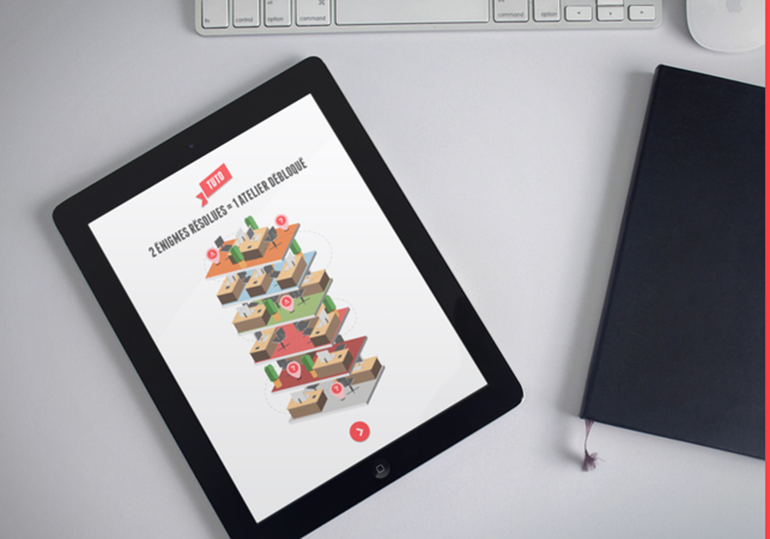
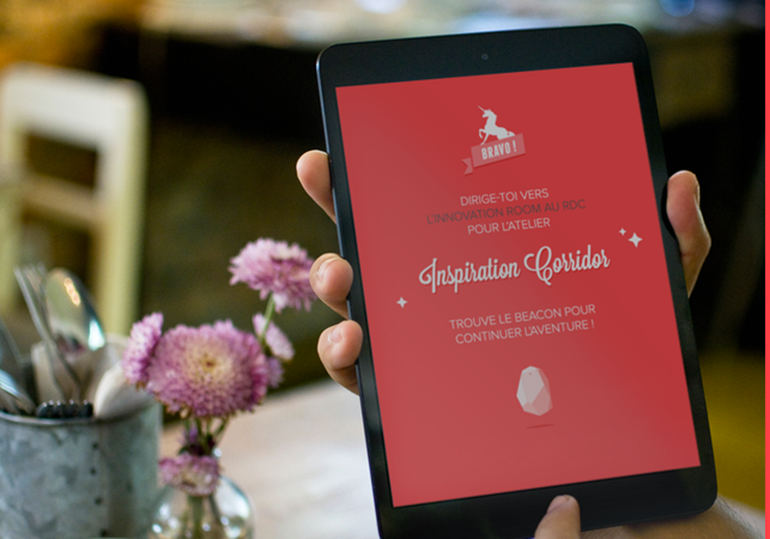
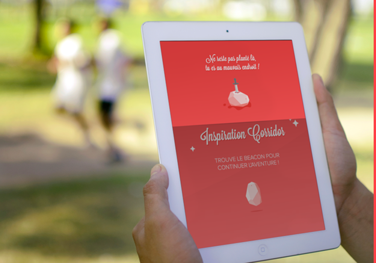
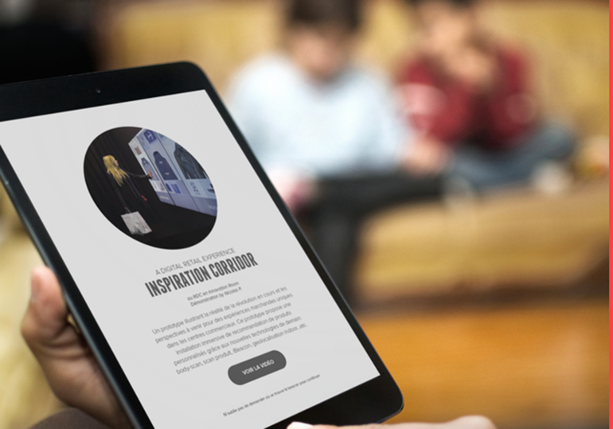

#THE MAGICAL MARVELLOUS INNOVATION HUNT WITH UNICORNS IN IT !
=========

DigitasLBi Paris change the agency into an innovation course! Twelve enigmas, 6 workshops and one price. Equipped with an iPad, you will complete your innovation hunt with the Beacons. Without them, nothing is possible!

//Video in fr

##The app
For this innovation hunt, we decided to create an iPad app which uses iBeacon technology. This app is divided into four parts:

- Login: each team is invited to create a name for the team and to provide us with an email to contact them after the course
- Enigmas: after login, we push two enigmas randomly. Each team has to meet the DigitasLBi Paris staff to answer them
- Beacon: enigmas are related to a workshop. So after solving, each team has to find the Beacon to discover an innovation. We used the RSSI signal to define where the iPad is in the agency and give it some clues to find the Beacon
- Workshop: when the team finds a Beacon, it triggers automatically the workshop related content to give more information 

##How Beacon technology works

For this project, we used Estimote Beacon. An Estimote Beacon is a small, wireless device, sometimes also called a 'mote'. When placed in a physical space, it broadcasts tiny radio signals to smart devices.

Each Beacon has a built-in Bluetooth® 4.0 chip, also called a BLE (Bluetooth® low energy). When installed, the Beacons begin transmit 2.4 GHz Bluetooth® signals which communicate with smartphones that are as close as four inches away, or as far as 200 feet away.

##App Screenshot

##Credits

- Copywriter: Nolwenn de La Pintière
- Creative Technology: Julien Terraz
- Creative Coding: Nicolas Petremann
- Motion Director: Jeremy Vissio
- Graphic Design: Aline Kesting
- Beacons: Estimote Beacon technology